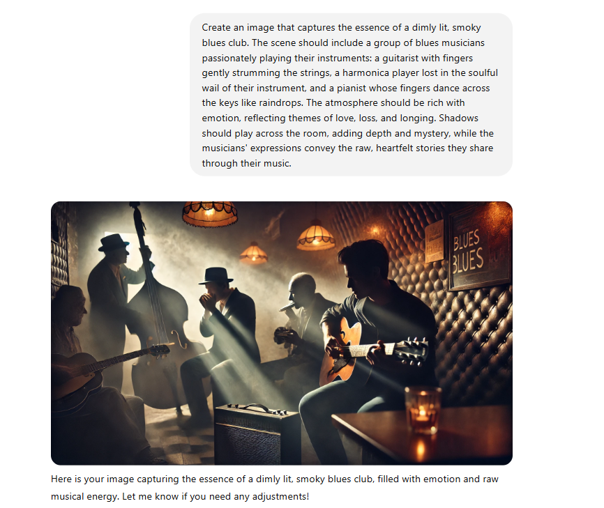

# MultiAgentPatterns with Durable Functions

This project is a fun project of myself. Implement [Multi-Agent Design Patterns](https://microsoft.github.io/autogen/dev/user-guide/core-user-guide/design-patterns/intro.html#) on top of Durable Functions. We use the patterns [Building Serverless AI Agents using Durable Functions on Azure](https://blog.cgillum.tech/building-serverless-ai-agents-using-durable-functions-on-azure-e1272882082c) that Chris Gillum worte.

You can learn how to utilize Durable Functions with AI scneario.

# Motivation

I believe Durable Functions are one of the most powerful tool of AI agent workload. Famous AI Agent case study [How Toyota uses Azure Cosmos DB to power their multi-agent AI system for enhanced productivity](https://devblogs.microsoft.com/cosmosdb/toyota-motor-corporation-innovates-design-development-with-multi-agent-ai-system-and-cosmos-db/) explains they use Durable Functions to implement multi-agent system. The nature of the programmable workflow on Distributed System, Durable Functions can be the first option. So that for learning my self, I play with Durable Functions and Durable Entitiy to implement latest patterns that is introduced by AutoGen. It helps the scenario of Serverless Distributed System with Multi-AI-Agent scenario with proven architecture.


# How to use

## local.settings.json

Create local.settings.json with following format.

```
{
  "IsEncrypted": false,
  "Values": {
    "Settings:OpenAIEndpoint": "https://<YOUR_OPENAI_SERVICE_NAME>.openai.azure.com/",
    "Settings:OpenAIKey": "<YOUR_OPEN_AI_KEY>",
    "Settings:OpenAIDeployment": "<YOUR_DEPLOYMENT_NAME>",
    "AzureWebJobsStorage": "UseDevelopmentStorage=true",
    "FUNCTIONS_WORKER_RUNTIME": "dotnet-isolated"
  }
}
```

# Run the Durable Functions

Start [Azurite](https://learn.microsoft.com/en-us/azure/storage/common/storage-use-azurite?tabs=visual-studio%2Cblob-storage).
Then run Durable Functions. If you use Visual Studio, hit F5.

# Group Chat scneario

I started with simple Group Chat scenario. Topic is poem writing.

We have three agents. 

* PoemAgent: Write a poem for you
* EditorAgent: Write a prompt to generate image that fit for the poem. (Sorry, I can generate the image but for now making it simple.)
* ReviewAgent: Review the poem and approve if it is proper. If not reject it and ask rewrite.

Facilitator Agent observe the conversation history and distpacth to the proper agent. 

## Run Group Chat Scenario

`POST: http://localhost:7062/api/GroupChatOrchstrator_HttpStart`

with 

```
{
"RequestId": "<GUID or RequestId>",
"UserPrompt": "Could you write a poem for blues artists?"
}
```

Open the `statusQueryGetUri` You will see the result. for example.

```json
{
    "name": "GroupChatOrchstrator",
    "instanceId": "request06",
    "runtimeStatus": "Completed",
    "input": {
        "RequestId": "request06",
        "UserPrompt": "Progress the next step. Select the next Agent."
    },
    "customStatus": null,
    "output": {
        "UserPrompt": null,
        "Conversation": [
            "[Facilitator] Could you write a poem for blues artists?",
            "[PoetAgent] In the dim-lit corners of a smoky room,  \nWhere shadows dance to a soulful tune,  \nThe blues artists gather, hearts worn and true,  \nWith stories to tell, in shades of deep blue.\n\nTheir fingers caress the strings with grace,  \nEach note a whisper, a tear-streaked trace,  \nOf love lost and found, of dreams that fade,  \nIn the haunting echoes their souls have made.\n\nThe harmonica wails like a distant train,  \nCarrying burdens of joy and pain,  \nWhile the piano keys, like raindrops fall,  \nIn a rhythm that answers the heart's own call.\n\nTheir voices, raw as the earth's embrace,  \nSing of longing, of time's slow pace,  \nOf crossroads met and choices made,  \nIn the tapestry of life, where shadows played.\n\nOh, blues artists, with hearts so wide,  \nYou paint the world with a mournful pride,  \nIn every chord, a story unfolds,  \nOf the human spirit, brave and bold.\n\nSo play on, dear artists, in the night’s embrace,  \nWith your music that time cannot erase,  \nFor in your blues, we find our own,  \nA shared lament, a common home.",
            "[Facilitator] Progress the next step. Select the next Agent.",
            "[EditorAgent] Create an image that captures the essence of a dimly lit, smoky blues club. The scene should include a group of blues musicians passionately playing their instruments: a guitarist with fingers gently strumming the strings, a harmonica player lost in the soulful wail of their instrument, and a pianist whose fingers dance across the keys like raindrops. The atmosphere should be rich with emotion, reflecting themes of love, loss, and longing. Shadows should play across the room, adding depth and mystery, while the musicians' expressions convey the raw, heartfelt stories they share through their music.",
            "[Facilitator] Progress the next step. Select the next Agent.",
            "The poem beautifully captures the essence of blues music and the artists who create it. It paints a vivid picture of the setting and the emotions involved, effectively conveying the themes of love, loss, and longing that are central to the blues genre. The imagery is rich and evocative, and the rhythm of the poem mirrors the soulful, melancholic nature of blues music. The poem is well-structured and maintains a consistent tone throughout, making it a fitting tribute to blues artists. No further edits are necessary as it meets the original request with professional quality."
        ],
        "Answer": null
    },
    "createdTime": "2025-02-14T05:28:14Z",
    "lastUpdatedTime": "2025-02-14T05:28:20Z"
}
```

I put the instruction of the Editor Agent on ChatGPT.



# TODO

This is very early version. I'm going to enjoy following:

* Use multi-modal and generate images
* Use Streamlit to create a UI so that people can enjoy more
* Implement more patterns
* Use Microsoft.Extensions.AI library